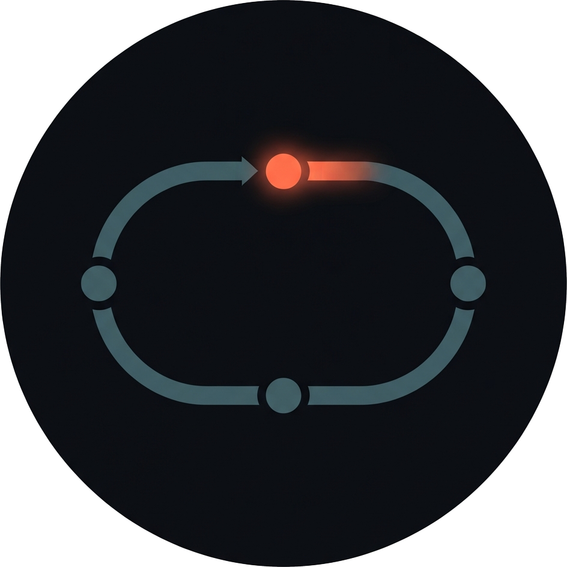
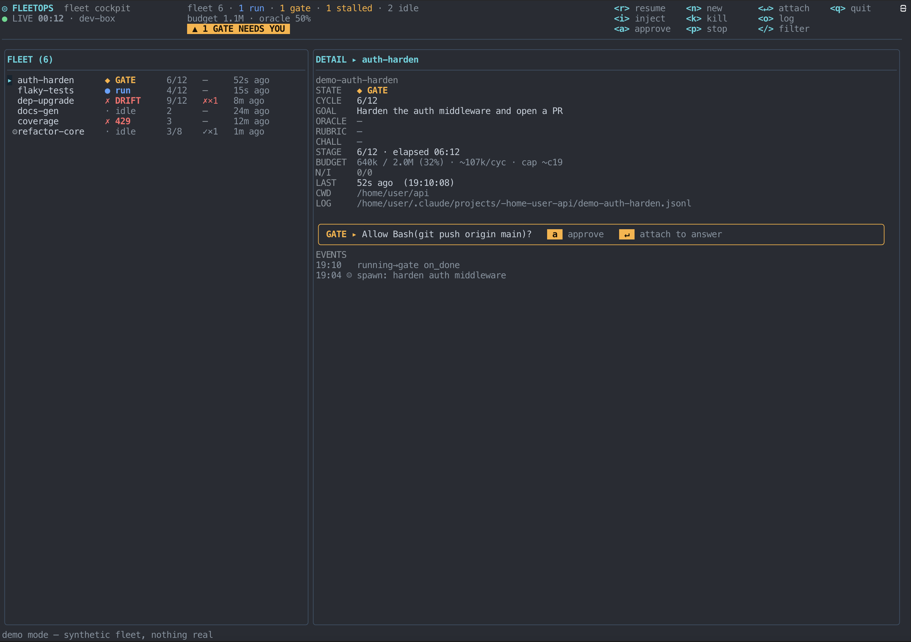

<p align="center">
  
</p>

<h1 align="center">fleetops</h1>

<p align="center">A fleet cockpit for Claude Code loops, in your terminal.</p>



_(the fleet above is `fleetops --demo` — a synthetic fleet, nothing real)_

> **Status: experimental / 0.1.0-alpha.** This is a young, actively-changing
> project — expect rough edges, and read the "Known rough edges" and
> "Limitations" sections below before trusting it with anything you can't
> afford to have go wrong (it does send real keystrokes and can kill real
> processes; see "How it works").

You run several `claude` sessions across projects — some grinding on a task, some
waiting on a permission prompt, some silently dead. fleetops watches
`~/.claude/projects/`'s own session logs, works out what's *actually* happening
in each one, and lets you act on it with one key — without switching terminals
to find out.

## What it does

- **Observes** every Claude Code session by reading its JSONL transcript and file
  mtime. No screen-scraping, no polling `tmux`/`orca` for content.
- **Detects real state**, not just "wrote recently": `run` (mid-turn), `idle`
  (finished a turn, waiting on you), `◆ GATE` (a permission prompt fired), `◆
  STALLED` / `✗ 429` (stuck or rate-limited), `✗ gone` (the terminal closed or
  the process died), and for goal-bound loops, `✓ DONE` / `✗ DRIFT` (see
  Oracle below).
- **Acts in one key** — attach, resume, approve a gate, stop a turn, kill, or
  spawn a brand new loop — across whichever terminal multiplexer hosts the
  session (orca, tmux, cmux). On a bare terminal with no multiplexer, it still
  degrades to a copy-pasteable manual command instead of doing nothing.

## Install

```bash
go install github.com/jitokim/fleetops/cmd/fleetops@latest
```

This puts a `fleetops` binary on `$GOBIN` (or `$GOPATH/bin` — usually
`~/go/bin`). Make sure that directory is on your `PATH`.

Building from a local clone instead:

```bash
git clone https://github.com/jitokim/fleetops.git
cd fleetops
make install    # go install ./cmd/fleetops — same result as above
# or: make build  → ./fleetops (a local binary, not installed to PATH)
```

## Quick start

```bash
fleetops                 # launch the fleet cockpit
fleetops hooks install   # wire up gate detection (see below)
```

`hooks install` registers a Claude Code `Notification` hook
(`fleetops hook notify`) in `~/.claude/settings.json`, backing up the existing
file first. `hooks uninstall` removes only the entry fleetops added.

**Try it without any real loops:** `fleetops --demo` launches the cockpit
seeded with a small synthetic fleet instead of scanning `~/.claude/projects` —
no disk reads of real session data, no writes anywhere. Useful for a first
look at the UI, or for screenshotting it without leaking real paths/goals.

## Keymap

| Key | Action |
|---|---|
| `↑` `↓` | move selection |
| `/` | filter the fleet (live, by project/session/state/stall — `esc` clears, `enter` applies) |
| `↵` | attach: bring the loop's terminal to the front |
| `a` | approve a gate (bare Enter — accepts claude's default option) |
| `r` | resume a stalled/drifted loop (re-sends its last prompt) |
| `p` | stop the current turn (Esc) without killing the process |
| `k` | kill — press twice within 3s to confirm (sends `/exit`) |
| `n` | spawn a new loop: prompts for a goal (plus an optional display name for the FLEET list), starts `claude` in the selected loop's directory (or cwd) |
| `o` | open the session log in `less` |
| `d` | dismiss: hide the selected loop from the list until restart (doesn't touch the session) |
| `q` | quit |

## How it works

**Observation.** `internal/claude` globs `~/.claude/projects/*/*.jsonl`, uses each
file's mtime as "last activity", and tails the last ~24KB to classify the loop:
a finished turn (`stop_reason: end_turn`) is idle regardless of how long ago
that was; mid-turn is `run` if recent, `stalled` once past a threshold (`429`
detected from the tail text). A `ps`/`lsof` cross-check (`internal/claude`'s
liveness pass) catches the case a session looks idle but its `claude` process
is actually gone — that's `✗ gone`, not idle.

**Gates.** `fleetops hook notify` writes a small marker file
(`~/.fleetops/gates/`) every time Claude Code's `Notification` hook fires.
Only markers whose `notification_type` means "blocked on a human"
(`permission_prompt`, `elicitation_dialog`, `agent_needs_input`) become a real
`◆ GATE` — the same hook also fires for the 60s "waiting for your input" idle
nudge, which is not a gate. A marker goes stale (and is deleted) once the
transcript shows new activity after it fired — the human already answered.

**Oracle.** Loops spawned via `n` are goal-bound: fleetops knows what they're
trying to achieve, so it can judge them. Once idle, `internal/oracle` asks a
cheap model (`claude -p --model haiku --output-format json`) to verdict the
loop's last report against its goal — never trusting the agent's own "done"
claim. `done` → `✓ DONE`; a false "done" claim → `✗ DRIFT` (re-drive with `r`,
or kill); real work with no claim either way → `progress`, state unchanged. A
no-improve counter (`N/I`) tracks consecutive rejections. Observed sessions
that weren't spawned by fleetops have no goal, so no verdict — shown as `—`.

**Budget.** The BUDGET column/bar tracks `output_tokens` only (summed across
the session) against a 2,000,000-token default cap per loop —
`input_tokens`/cache tokens re-bill the whole conversation context on every
single call, so summing those would wildly overstate spend rather than
reflect actual work done.

## Automation (opt-in, off by default)

fleetops is pure observation + one-key human actuation everywhere else in
this document. There is exactly ONE piece of automation it ships today, and
it is **opt-in and off by default**:

### 429 auto-redrive

Set `FLEETOPS_AUTO_REDRIVE_429=1` in the environment fleetops runs in to
enable it. Unset it (or don't set it at all) to disable — there is no
in-app toggle for this yet, and no per-loop override; it's a single global
switch.

**What it does:** when a loop's state transition lands it in `✗ 429`
(rate-limited) — the same scan edge that would otherwise just sit there
until you notice and press `r` — fleetops schedules ONE automatic
re-drive 5 minutes later, via the exact same headless
`claude --resume <id> -p "<prompt>"` path Tier 2 uses for a manual resume.
Before firing, it re-checks the loop's CURRENT state: if you already
resumed it yourself, or it recovered on its own, the scheduled auto-redrive
silently does nothing.

**Ceilings (both per session, not per day):**
- At most **3 lifetime attempts** — recounted from the append-only event
  log on every fleetops restart, so restarting doesn't reset the counter.
- At most one scheduled at a time — a second 429 edge for the same session
  within 5 minutes of the last schedule doesn't queue another.
- On the 3rd attempt failing, you get a desktop notification
  ("🚀 fleetops · auto-redrive exhausted") and nothing further is
  scheduled for that session.

Every attempt (success or failure) is recorded in the event log
(`actor: auto`, distinct from every human-triggered actuation event, which
is always `actor: human`) — visible in `fleetops report` and the DETAIL
panel's EVENTS block.

**Why this is the only automation, and why it's built this way — the
design rationale:**
- **Tier 2 only.** It never types into a terminal. Every OTHER actuation
  in this codebase (resume/inject/approve/kill) can fall back to typing
  into a live pane, which carries a "wrong surface" hazard if session
  identity is ambiguous. An automated, unattended action can't be allowed
  anywhere near that risk at all — Tier 2's `claude --resume <id>` is
  keyed by session id, not by a terminal pane, so there is no surface to
  get wrong.
- **Idempotent.** Re-sending a resume against a session that already
  recovered is a harmless no-op turn, not a destructive action — this is
  why 429 (a transient, well-understood failure mode) was judged safe to
  automate at all, unlike e.g. an oracle-rejected DRIFT (which needs a
  human's judgment call, see `r` on a DRIFT loop's guided re-drive) or a
  StateFailed loop (the governor already decided to stop it — automation
  overriding that would defeat the governor's whole purpose).
- **Transient, not a judgment call.** A 429 is "the API said slow down,"
  not "something is wrong with this loop's approach" — there's no
  reasoning required to decide whether retrying is appropriate, unlike
  DRIFT or a repeated no-improve stall.
- **Honest about what survives a restart.** The 5-minute delay is a
  `tea.Tick`, not a persisted job — if you quit fleetops before it
  fires, the pending retry is simply lost. No silent double-fire risk, no
  stale on-disk schedule to reconcile on the next launch.

## Engine (opt-in, off by default)

fleetops also ships a minimal **LoopEngine**: given a goal, done-condition,
and verification rubric, it can drive a loop's cycles itself instead of
waiting for you to press `r`/`i` each time. It is a **governance harness, not
an agent runtime** — it doesn't add a smarter agent, model selection, or
context management; it just automates the same "judge, then re-drive"
decision a human would otherwise make by hand, behind two explicit gates:

1. The `FLEETOPS_ENGINE=1` environment variable must be set.
2. The specific loop must have been created with the `n` wizard's
   engine-drive choice (`e`), not the default manual path.

Both are required — unset the env var and every engine-owned loop goes
inert (still observed, never driven). A loop the engine drives shows a `⚙`
marker in the fleet list and a `DRIVE` row in the detail panel.

**What it will and won't do:**
- Drives ONLY on a `progress` verdict from the oracle. A verdict the oracle
  *rejects* halts the loop (`✗ DRIFT`) for a human to look at — the engine
  never auto-re-drives a loop the oracle just rejected. This is deliberate:
  an agent that's wrong about being "done" is exactly the moment a human
  should own the next decision, not the engine.
- Respects the same budget/max-cycles/no-improve governor ceilings as
  everything else in this document — it stops or escalates rather than
  running past them.
- Never approves a gate. A live permission prompt halts it exactly like it
  halts a human-driven loop; only a human's `a` clears it.
- `↵` (attach) on an engine-driven loop is a take-over: it opens
  `claude --resume <id>` in a fresh terminal so you can drive the session
  interactively, and hands ownership back to you (the engine stops
  scheduling further cycles for it). `k` (kill) on one clears engine
  ownership instead of sending `/exit` (there's no terminal to send it to).

See [`DESIGN.md`](./DESIGN.md) for the fail-closed drive predicate and the
full state machine.

## Platform support

**macOS is the only platform the full backend matrix works on.** This isn't
just the "macOS-first" Limitations bullet below being cautious — it's the
actual state of each backend:

- **orca** ([stablyai/orca](https://github.com/stablyai/orca)) is macOS-native.
- **cmux** ([manaflow-ai/cmux](https://github.com/manaflow-ai/cmux)) is
  macOS-native.
- **tmux** is the only backend that's cross-platform by itself, but
  fleetops's own process-liveness check (`internal/claude`'s liveness pass)
  shells out to `ps axo pid,comm` and `lsof` — a BSD/macOS-flavored check, not
  Linux's `/proc`. So even the tmux path is unverified and likely degraded on
  Linux (liveness detection specifically — you may see a session reported as
  live/idle when its process actually died, or vice versa).

Net effect: a **Windows** user has no working backend at all today — you get
the bare-terminal manual-hint fallback only. A **Linux** user gets tmux, but
with unverified liveness detection. Only **macOS** gets the full matrix below.

## Backend matrix

| Backend | Attach/Resume/Approve/Stop | Spawn | Status |
|---|---|---|---|
| **orca** | ✅ | ✅ | Verified live against the real CLI; preferred when available. |
| **tmux** | ✅ | ✅ | Verified against tmux's documented command contract. |
| **cmux** | ✅ (locate/send/focus/approve/interrupt) | ❌ | Verified against real **cmux 0.64.15**: `tree --json` shape, and `send`/`send-key`/`focus-panel` subcommands — including **cross-workspace addressing**: each actuation now passes `--window <ref>` so a surface outside the caller's own workspace is reachable (verified live; without it a cross-workspace target failed). Its tree carries no cwd, so surface→dir matching cross-references the OS by tty (`ps`+`lsof`). Spawn is still unsupported (no verified create-surface command). |
| **bare terminal** (none of the above) | manual hint only | manual hint only | Observation still works fully; actions print a copy-pasteable command (`claude --resume <id>`, `cd <dir>`, etc.) instead of silently failing. |

The cmux backend requires a separately-installed CLI
([manaflow-ai/cmux](https://github.com/manaflow-ai/cmux)) that is
**independently licensed AGPL-3.0-or-later as of 2026-02-14** — this doesn't
affect fleetops's own MIT license (the same relationship as any tool that
shells out to `git`), but know what you're installing before you opt into
that backend.

`internal/control.Resolve()` picks the first available backend in that order
(orca → cmux → tmux).

### Capability tiers (session identity, not just backend)

Since the session-identity registry (`fleetops hooks install`'s
`SessionStart`/`SessionEnd` hooks), which terminal/backend hosts a session
matters less than what fleetops actually *knows* about it. Every typed
action (resume/approve/stop/kill/inject) now resolves in tiers, falling
through automatically:

1. **Tier 1a — registry tty (tmux only).** If the session registry has a
   live tty for the loop (written at `SessionStart`, re-validated against a
   live `ps` at actuation time), fleetops dispatches straight to that tmux
   pane by tty — session-unique, so two loops sharing a project directory
   are no longer ambiguous to each other.
2. **Tier 1b — cwd-based match (orca/cmux/tmux).** The existing
   `Locate`/`LocateClaude` chain, unchanged — still guarded against
   ambiguity when more than one loop shares a directory.
3. **Tier 2 — headless re-drive (every backend, every host).**
   `claude --resume <id> -p "<prompt>"` continues the SAME session as a
   fresh background turn, appending to the SAME transcript the cockpit
   already tails. No terminal surface needed at all — this is what makes a
   loop whose terminal died (`process gone`) resumable again, and it's the
   only path available for a session with no multiplexer backend (a bare
   terminal, an IDE-hosted shell, etc.) once Tier 1 can't find a surface.

See `docs/adr-vendor-independent-actuation.md` for the full design and
verification notes.

## Limitations

- **No goal, no oracle.** A session fleetops didn't spawn has no recorded
  goal, so it can never show `DONE`/`DRIFT`/`N-I` — only the tail-based
  state (`run`/`idle`/`stalled`/etc).
- **cmux: verified shape, partially-verified actuation.** The `tree --json`
  parser was verified against real cmux **0.64.15** (surface identity is the
  `ref` key; terminal surfaces carry `type:"terminal"` + `tty`; browser tabs
  carry `tty:null`), and the parser stays tolerant of unknown shapes. Because
  the tree has no cwd field, a surface's directory is resolved by
  cross-referencing its tty against the OS process table (`ps`+`lsof`), the
  same pattern `internal/claude` uses. `send`/`send-key`/`focus-panel` and the
  `enter` key token are verified from the CLI's own help; the `escape` (Esc /
  interrupt) key token and the end-to-end effect of Resume/Approve on a live
  claude gate are still assumed (no live claude-in-cmux session was safe to
  drive). Verified on this cmux version only, not all cmux releases.
- **cmux: cross-workspace addressing (`--window`).** A `--surface`/`--panel`
  ref is resolved by cmux within a *window* context; with `--window` omitted
  that context defaults to the caller's own workspace (`$CMUX_WORKSPACE_ID`),
  so a surface in **any other workspace** silently fails ("Surface not found" /
  "Surface is not a terminal") — the earlier "verified subcommands" work only
  covered the flags, not this addressing gap. Locate/LocateClaude now capture
  each surface's enclosing `window:<n>` ref while walking the tree
  (`Target.Window`), and every actuation appends `--window <ref>` when it is
  set. This was reproduced and fixed live on cmux 0.64.15 for all three
  subcommands by driving a throwaway cross-workspace surface: each failed
  without `--window` and succeeded with it, correctly targeting the
  other workspace. A **same-workspace** target accepts `--window` as a verified
  no-op, so there is no regression. orca/tmux leave `Target.Window` empty (their
  handles/pane-ids are already globally addressable), so their argv is unchanged.
- **macOS-first.** See "Platform support" above — orca and cmux are
  macOS-native, and even the cross-platform tmux backend's liveness check is
  unverified on Linux and has no working path on Windows.
- **The engine is intentionally minimal.** See "Engine" above — it's a
  governance harness (judge, then re-drive on progress), not an autonomous
  agent runtime. No self-chaining (it drives at most once per scan tick),
  no challenger execution, no per-loop model/permission config. See
  [`VISION.md`](./VISION.md) for the longer-term direction this project is
  named for — that document describes a more expansive future, not current
  behavior.

## Known rough edges

Honest framing, not spin: this codebase's real-world actuation testing is
very fresh and thin, and most of what's caught it so far has been manual
dogfooding, not test coverage or review.

The clearest example: the cmux backend's `Locate`/`LocateClaude` (surface
lookup) and its cross-workspace actuation (the `--window` addressing
described above) were **both completely non-functional against the real cmux
CLI** — not degraded, not flaky, but dead-on-arrival — until two same-day
bugfixes landed. Both bugs shipped, then were caught and fixed the same day
they were dogfooded, not by a test or a review catching them beforehand. If
you're relying on the cmux backend for anything you care about, be aware that
"verified against real cmux X.Y.Z" in this README means "worked when someone
manually drove it that day," not "covered by regression tests" — there isn't
CI or a test harness that exercises the real CLI yet.

More generally: everything under "Limitations" above that says "verified
live" or "reproduced and fixed live" was verified by a human manually driving
the real CLI once, on one version, not by automated tests. Treat those
claims as "known to have worked at some point," not "guaranteed to keep
working."
